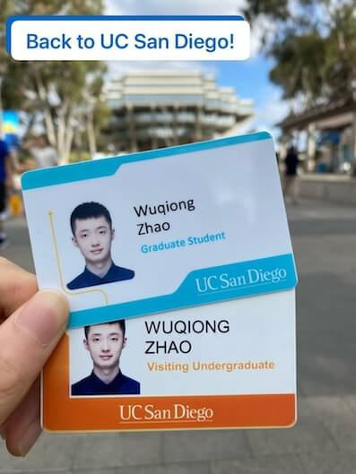

## Back to University of California San Diego
I have been back to the United States as a PhD student at the University of California San Diego!
It is a great place to study and live.
I will share more later on this website, now that I have reduced the use of Twitter.
It is good to host information on my own open-source platform.

> It is great to be back at UC San Diego as a PhD student! Last year, I enjoyed a fascinating summer as a visiting undergraduate. Now, I am more than excited to start the new journey here.
> (from [my LinkedIn post](https://www.linkedin.com/posts/wuqiong-zhao_it-is-great-to-be-back-at-uc-san-diego-as-activity-7243704626540077056-w6xv))

## More on This Journal
Besides, I will continue to work on the LaTeX template for this journal,
which is open source at [GitHub](https://github.com/j-wqzhao/j-wqzhao.cls).
The operation of this journal will shift a little from publishing in PDF.
HTML (generated from Markdown) formats are also supported, because we want to facilitate the faster sharing of information!
(Well, I am not saying I am being lazy to write a LaTeX document. Yes, I am honest.)
